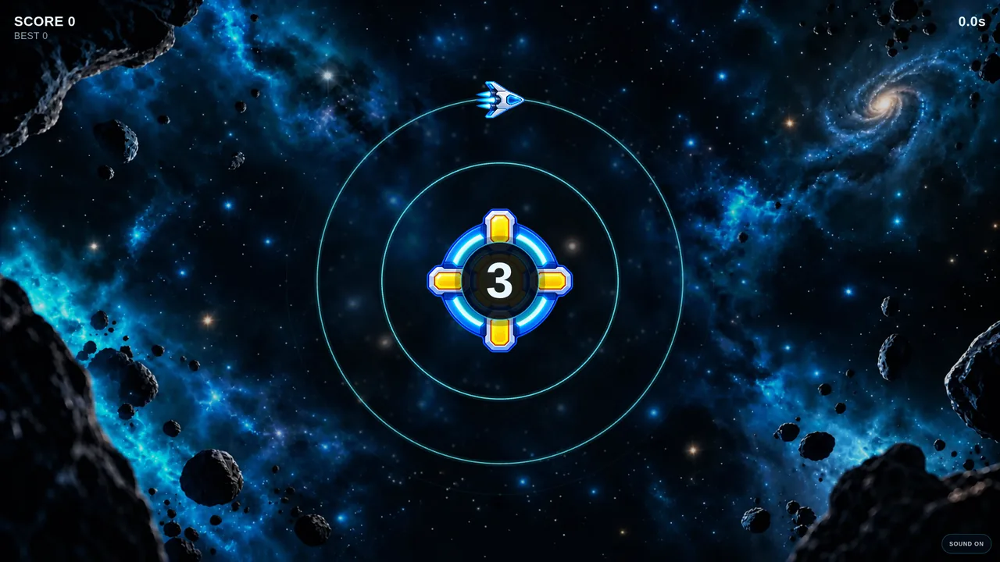
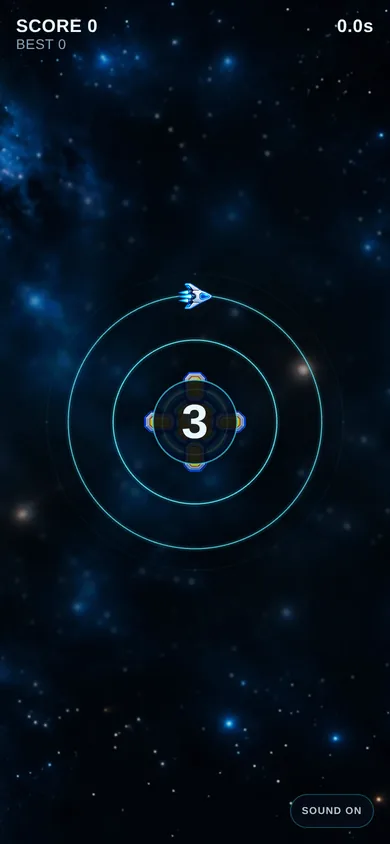
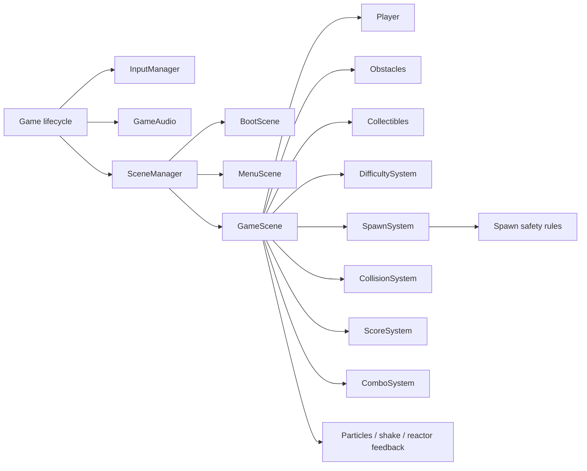

<div align="center">

# Orbit Shift

**One input. Two orbits. Stay alive.**

A responsive HTML5 arcade game built with **TypeScript**, **PixiJS v8**, and **Vite**.

[**Play live**](https://orbit-shift-static-production.up.railway.app) · [**v1.0.0 release**](https://github.com/maxkurylenko1/orbit-shift/releases/tag/v1.0.0) · [**QA workflow**](https://github.com/maxkurylenko1/orbit-shift/actions/workflows/v1-qa.yml)


</div>

<p align="center">
  
</p>

## About

**Orbit Shift** is a compact, one-action arcade game built as a frontend game-engineering portfolio project.

You pilot a ship around a reactor on two concentric lanes. Tap, click, or press Space to switch orbit at the right moment, avoid hazards, collect energy shards, build a combo, and survive as the game accelerates.

The project is intentionally small in scope. The focus is on the parts that make an HTML5 game feel finished: **responsive rendering, readable game state, fair procedural pressure, input feel, audio feedback, maintainable architecture, and automated QA**.

## Gameplay

- **One action:** switch between the inner and outer orbit.
- **Progressive pressure:** speed, spawn cadence, pattern complexity, and surge intensity increase during a run.
- **Energy shards:** pickups add score and build a combo multiplier.
- **Fair spawning:** safety rules prevent impossible dual-lane blockades.
- **Fast restart loop:** collision → game over → immediate retry.
- **Persistent best score:** stored locally in the browser.

### Controls

| Action | Input |
| --- | --- |
| Start / restart | Tap, click, or **Space** |
| Switch orbit | Tap, click, or **Space** |
| Toggle sound | **M** or the SOUND button |

## Engineering highlights

| Area | Implementation |
| --- | --- |
| Rendering | PixiJS v8 with responsive scene sizing and device-pixel-ratio capped at 2 |
| Mobile layout | Safe-area-aware HUD plus `visualViewport` handling for orientation and viewport changes |
| Architecture | Game lifecycle, scenes, entities, presentation helpers, and gameplay systems kept separate |
| Spawn fairness | Protected hazard spacing, seeded run variation, and opposite-lane blockade prevention |
| Difficulty | Multi-stage speed/spawn ramp with higher-tier patterns and periodic surge windows |
| Input | Unified mouse, touch, and keyboard action model |
| Audio | Procedural Web Audio feedback with persistent mute preference |
| State | `localStorage` for best score and audio preference |
| Asset pipeline | Lightweight WebP game art loaded up front through PixiJS Assets |
| QA | Unit/regression tests, seeded five-minute simulations, production build checks, and real-browser smoke tests |

## Responsive by design

<p align="center">
  
</p>

The same gameplay scene adapts from small phones to ultrawide displays without changing the core rules or creating a separate mobile implementation.

The v1 release browser suite covers:

| Viewport | Coverage |
| --- | --- |
| 375 × 667 | Small phone portrait |
| 390 × 844 | Modern phone portrait |
| 844 × 390 | Phone landscape |
| 1366 × 768 | Laptop |
| 1920 × 1080 | Desktop |
| 3440 × 1440 | Ultrawide |

The game also detects viewport geometry changes during play, so the PixiJS canvas follows mobile orientation changes even when a browser does not emit a reliable traditional resize event.

## Architecture



The core idea is to keep **game rules testable without rendering**. Timing, spawn safety, difficulty, scoring, and layout calculations live outside the PixiJS scene whenever practical, while scenes compose those systems into the real-time experience.

## Game feel

The one-button mechanic is deliberately simple, so feedback has to carry a lot of the experience.

Orbit Shift uses:

- short lane-switch transitions;
- ship tilt, squash, trail, and glow;
- reactor pulses on actions and pickups;
- collision particles and screen shake;
- pickup particles and combo feedback;
- procedural switch, pickup, countdown, surge, and collision sounds;
- a darker gameplay arena to preserve contrast against the space background.

## Fair difficulty

Increasing difficulty should create pressure without generating impossible states.

The spawn pipeline therefore combines:

1. tiered obstacle patterns;
2. minimum hazard spacing based on current player speed;
3. safe-lane resolution to avoid simultaneous opposite-lane blockades;
4. limited active obstacle counts;
5. controlled elapsed-time handling so tab stalls do not produce a burst of catch-up hazards.

The automated QA suite also includes **seeded five-minute runs** to verify that late-game pressure increases while both lanes remain playable.

## Quality gate

The **v1.0.0** release passed the complete project QA workflow:

- **20 / 20** gameplay regression tests;
- **60 / 60** total automated tests;
- TypeScript typecheck;
- production Vite build;
- preview HTTP smoke test;
- all five production visual assets requested successfully;
- browser smoke tests on six viewport configurations;
- mobile orientation resize;
- mute persistence, mouse/touch/keyboard input, and runtime JavaScript error checks.

Run the same checks locally with Node.js **22.16+**:

```bash
npm install

npm run typecheck
npm run test:gameplay
npm run test:all
npm run build
```

## Tech stack

- **TypeScript 7**
- **PixiJS 8**
- **Vite 8**
- **Web Audio API**
- **localStorage**
- **HTML / CSS**
- **Node.js test runner**
- **GitHub Actions**
- **Railway** for the production demo

PixiJS is the only runtime npm dependency.

## Project structure

```text
src/
  audio/          Procedural game audio and mute state
  background/     Responsive space background and tone treatment
  config/         Layout and visual sizing rules
  core/           Application, input, and scene lifecycle
  entities/       Player, obstacles, and collectibles
  presentation/   Rendering helpers and visual feedback
  scenes/         Boot, menu, and gameplay scenes
  systems/        Difficulty, spawning, safety, scoring, collision, combo
  ui/             Game-over and audio controls

tests/            Logic, visual-metric, long-run, and browser smoke tests
public/assets/    Production WebP game art
docs/readme/      Portfolio screenshots
```

## Run locally

```bash
git clone https://github.com/maxkurylenko1/orbit-shift.git
cd orbit-shift
npm install
npm run dev
```

Production build:

```bash
npm run build
npm run preview
```

## Scope decisions

v1 intentionally avoids extra systems such as shooting, upgrades, enemies, accounts, or multiplayer.

The goal was to prove that a very small mechanic can still feel polished when **game feel, fairness, responsiveness, and engineering discipline** are treated as first-class features.

## Release

**Orbit Shift v1.0.0** is the first production-ready release.

- **Live:** https://orbit-shift-static-production.up.railway.app
- **Release:** https://github.com/maxkurylenko1/orbit-shift/releases/tag/v1.0.0
- **Source:** https://github.com/maxkurylenko1/orbit-shift
